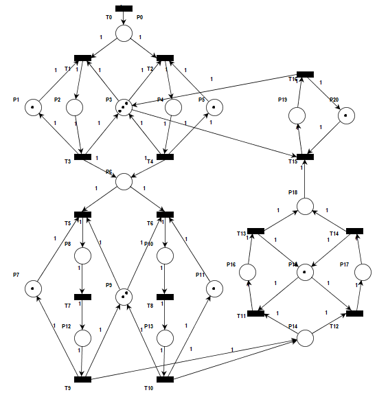

# Trabajo final de Programacion Concurrente
## Enunciado

En la figura se observa una red de Petri que modela un sistema doble de procesamiento de imágenes:
- **Plazas de recursos compartidos:** Las plazas {P1, P3, P5, P7, P9, P11, P15} representan recursos compartidos dentro del sistema.
- **Plaza idle:** La plaza {P0} corresponde al buffer de entrada de imágenes al sistema.
- **Carga de imágenes:** En las plazas {P2, P4} se realiza la carga de imágenes en el contenedor para procesamiento.
- **Contenedor de procesamiento:** La plaza {P6} representa el contenedor donde las imágenes esperan ser procesadas.
- **Ajuste de calidad:** Las plazas {P8, P10, P11, P13} corresponden a los estados en los que se realiza un ajuste de calidad de las imágenes en dos etapas secuenciales.
- **Contenedor de imágenes mejoradas:** La plaza {P14} modela el contenedor que almacena imágenes con calidad mejorada, listas para ser recortadas.
- **Recorte de imágenes:** En las plazas {P16, P17} se realiza el recorte de las imágenes a su tamaño definitivo.
- **Imágenes en estado final:** La plaza {P18} contiene las imágenes en estado final.
- **Exportación:** Finalmente, la plaza {P19} representa el proceso de exportación de las imágenes fuera del sistema.

  

